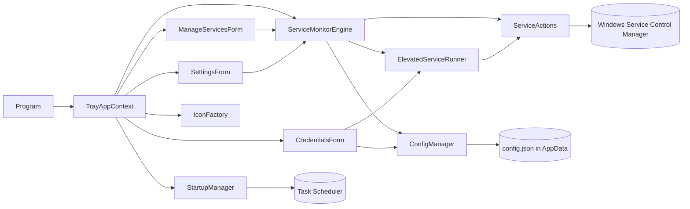

# 04 — Software Description (Technical Baseline, v1.0.1)

## 1. Product overview

| Item | Value |
|---|---|
| Name | Service Tray Monitor (installed product name: "SystemTrayMonitor" — see CR-002) |
| Manufacturer | Miautrix |
| Version | 1.0.1 (assembly `Version` and MSI `ProductVersion`) |
| Type | Windows desktop system-tray application (WinForms) |
| Runtime | .NET 8 (`net8.0-windows`), x64 Desktop Runtime |
| Elevation | `requireAdministrator` (UAC prompt at launch) |
| Package | Visual Studio Installer Project `Setup/SetupSTM` → `SetupSTM.msi` + `setup.exe` bootstrapper |
| External dependency | `System.ServiceProcess.ServiceController` 8.0.0 |

**Purpose.** Administrators pick Windows services to watch. The tray icon summarises their health by
colour, and the tray menu and main window start, stop, pause, and resume them.

**Users.** IT administrators and operators on Windows workstations or servers.

## 2. Functional summary

| Function | Where | Notes |
|---|---|---|
| Tray icon with summary colour | `TrayAppContext`, `IconFactory.SummaryColor` | Red if any service is stopped or missing; amber if pending or paused; green if all running; gray if none configured |
| Tooltip | `TrayAppContext.ApplyStatusesToTray` | First 8 services, trimmed to the 127-character limit |
| Tray menu per service | `TrayAppContext.BuildMenu` | Status dot plus Start/Stop/Pause/Resume, enabled by `ServiceActionRules` |
| Main window grid | `Forms/ManageServicesForm` | Sortable; updated in place each poll (keeps selection, sort, scroll) |
| Choose monitored services | `Forms/SettingsForm` | Filterable checklist; poll interval 2–300 s; Start with Windows |
| Admin credential | `Forms/CredentialsForm` | Save / Test / Clear; blank password keeps the saved one for the same login |
| Start with Windows | `Services/StartupManager` | Per-user scheduled task, run level Highest, no execution time limit |
| Polling | `Services/ServiceMonitorEngine` | `System.Timers.Timer`; serialized refreshes; overlapping ticks skipped |

## 3. Architecture

### Components

| Layer | File | Responsibility |
|---|---|---|
| Entry | `Program.cs` | STA entry point; runs `TrayAppContext` (no main window) |
| Shell | `TrayAppContext.cs` | Owns tray icon, menu, engine, and windows; installs the WinForms synchronization context; runs actions off the UI thread |
| UI | `Forms/ManageServicesForm.cs` | Grid of monitored services and action buttons |
| UI | `Forms/SettingsForm.cs` | Monitored-service selection, poll interval, Start with Windows |
| UI | `Forms/CredentialsForm.cs` | Admin credential entry, test, and clear |
| Model | `Models/MonitoredService.cs` | Live service state; `AppSettings` (persisted configuration) |
| Model | `Models/StatusPalette.cs` | Status colours (single source); `ServiceActionRules` (which actions are allowed) |
| Model | `Models/ServiceSelection.cs` | Checked-service working set independent of the filter; `InstalledService` record |
| Model | `Models/StoredCredential.cs` | Domain, username, and in-memory password |
| Service | `Services/ServiceMonitorEngine.cs` | Polling and status events; action entry points with the credential fallback |
| Service | `Services/ServiceActions.cs` | Start/Stop/Pause/Resume semantics and wait-for-state; error classification |
| Service | `Services/ElevatedServiceRunner.cs` | `LogonUser` (batch, then interactive) plus impersonation; credential test |
| Service | `Services/ConfigManager.cs` | `config.json` read/merge/write, DPAPI, corrupt-file backup, atomic save |
| Service | `Services/StartupManager.cs` | Scheduled-task registration and removal; legacy Run-key cleanup |
| Service | `Services/IconFactory.cs` | Runtime-drawn tray icons and menu dots (cached) |
| Tests | `Tests/ServiceTrayMonitor.Tests/` | xUnit suite (see doc 06) |
| Installer | `Setup/SetupSTM/SetupSTM.vdproj` | MSI to `[ProgramFiles64Folder]Miautrix\SystemTrayMonitor`; bootstrapper for .NET 8 Desktop Runtime |

## 4. Key flows

### 4.1 Status polling
1. The timer ticks every *PollIntervalSeconds* (minimum 1 s in the engine, 2 s in the UI).
2. If a refresh is already running, the tick is skipped. Manual refreshes queue on the thread pool and
   run one at a time.
3. Each monitored name is queried with `ServiceController`; missing services are marked `Exists = false`.
4. `StatusesUpdated` fires on a thread-pool thread. The tray posts to the UI synchronization context,
   and the main window uses `BeginInvoke`.

### 4.2 Service action (Start / Stop / Pause / Resume)
1. The UI disables the action controls and runs the action on a background task.
2. `ServiceMonitorEngine.Execute` runs the `ServiceActions` method with the app's own elevated token.
3. The action waits until the service reaches the target state (15 s timeout). Success means the state
   was reached. "Already running/stopped/paused" counts as success.
4. If Windows returns *Access is denied* and a credential is saved, the same action is retried inside
   `ElevatedServiceRunner.Run`: `LogonUser` with a **batch** logon (not UAC-filtered), falling back to an
   **interactive** logon if the batch right isn't granted. The action then runs under
   `WindowsIdentity.RunImpersonated`.
5. The result shows as a balloon (tray) or status line plus a message box on failure (window), and a
   refresh is queued.

### 4.3 Saving settings
- `SettingsForm` raises `SettingsSaved` with the general settings only.
- `ConfigManager.SaveGeneralSettings` re-reads the file, replaces the general fields, keeps the
  credential fields, and writes atomically (temp file + move).
- The engine interval and list are updated; `StartupManager.Apply` runs in the background.

### 4.4 Credential save and test
- **Save**: username and password are required. A blank password with an unchanged login reuses the
  saved password. Only credential fields are changed on disk.
- **Test**: signs in (batch, then interactive) and reports success only when the token is a full
  administrator token **and** the SCM can be opened with full access.

### 4.5 Start with Windows
- Enabled → task `ServiceTrayMonitor (<user>)` is registered from XML: logon trigger for that user,
  `InteractiveToken`, `HighestAvailable`, `ExecutionTimeLimit PT0S`, `IgnoreNew`.
- Disabled → the task is deleted if present. Both paths remove the legacy 1.0.0 `HKCU\...\Run` value.
- At launch, if enabled, the task is re-registered so it follows the current executable path.

## 5. Data

`%AppData%\ServiceTrayMonitor\config.json` (per Windows user):

| Field | Type | Default | Notes |
|---|---|---|---|
| `MonitoredServiceNames` | string[] | `[]` | Internal service names; order = display order at save |
| `PollIntervalSeconds` | int | 5 | UI range 2–300 |
| `StartWithWindows` | bool | false | Drives the scheduled task |
| `CredentialDomain` | string | "" | Blank = local account (`.`); ignored for UPN usernames |
| `CredentialUsername` | string | "" | Credential is "configured" when non-blank |
| `CredentialEncryptedPasswordBase64` | string | "" | DPAPI `CurrentUser` + fixed entropy, Base64 |

An unreadable file is renamed `config.json.corrupt-yyyyMMdd-HHmmss`; defaults are used and a balloon
warns the user.

## 6. Security model

- The process runs elevated (manifest). Service control uses that token first.
- The saved password is encrypted with DPAPI for the current Windows user. The entropy value is in the
  binary, so it is **not** a secret against other processes of the same user.
- The credential is used in-process through `LogonUser` and impersonation. It is never passed on a
  command line or to a child process (1.0.0 used `sc.exe` child processes).
- Least-privilege option: grant a dedicated account rights on specific services (`sc sdset`, see README).
- The executable and MSI are unsigned (CR-003).
- Settings, credential, and startup task belong to the **elevated** user. With over-the-shoulder UAC
  (another admin's credentials entered at the prompt), they belong to that admin (R-02).

## 7. Build, test, and packaging

| Task | Command / action |
|---|---|
| Build | `dotnet build ServiceTrayMonitor.sln -c Release` |
| Test | `dotnet test Tests/ServiceTrayMonitor.Tests -c Release` |
| Single-file exe | `dotnet publish -c Release -r win-x64 --self-contained true -p:PublishSingleFile=true` |
| MSI | Visual Studio → right-click **SetupSTM** → Build (Release). The setup project isn't included in the solution build configuration. |

Tooling used on 2026-09-13: .NET SDK 10.0.400 (targets net8.0), Visual Studio 18 (Community 18.9.2),
xUnit 2.9.3, xunit.runner.visualstudio 4.0.0, Microsoft.NET.Test.Sdk 18.10.0.

## 8. Known limitations (1.0.1)

- No Restart action (CR-001).
- Only local-machine services.
- The credential fallback is triggered only by *Access is denied*; other errors are reported as-is.
- The installer product name differs from the app name (CR-002); binaries are unsigned (CR-003).
- The tooltip shows at most 8 services (Windows limit of 127 characters).
